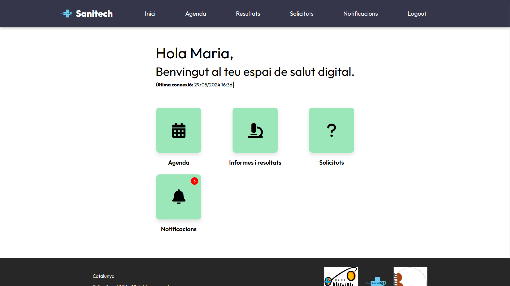
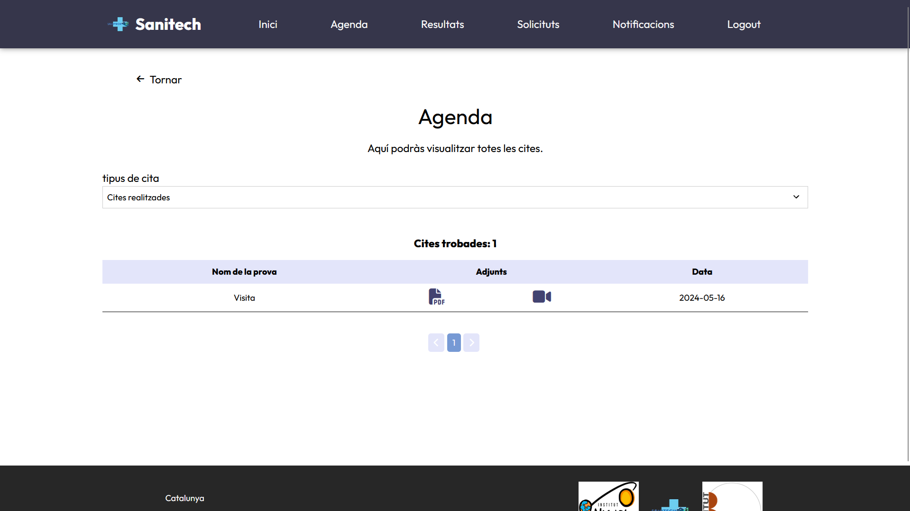
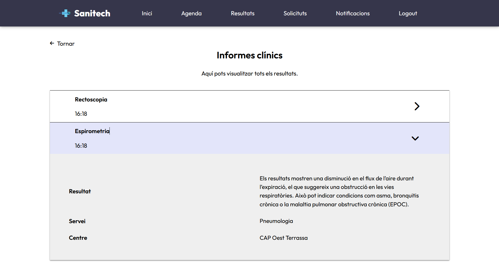
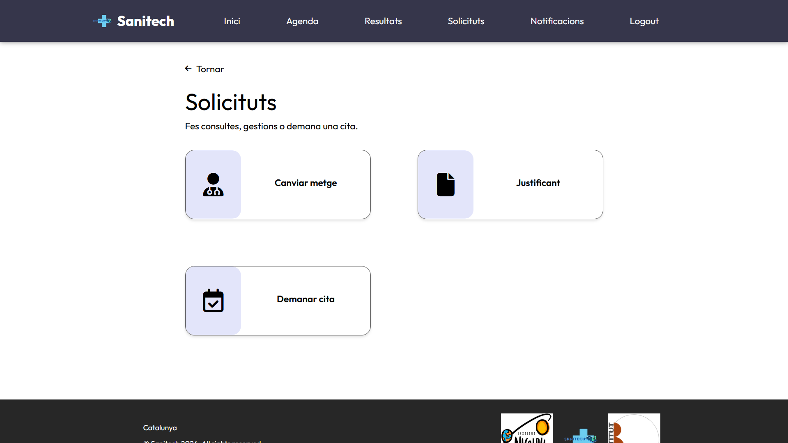

:toc-title: Índice de contenido
:table-caption: Tabla
:figure-caption: Imagen
:icons: font
:doctype: book
:encoding: utf-8
:lang: es
:toc: left
:numbered:

= Sanitech
Albert Mateos - Andres Rojas - Diego Amador - Samuel Garcia 

==  Introducción
Os presentamos la memoria del tercer proyecto del curso 2023-2024 de 2o de Desarrollo de Aplicaciones Web del instituto Nicolau Copèrnic. Este proyecto consta del desarrollo de una página web de gestión de pruebas de un centro médico, desarrollado para el las estudiantes del instituto Blanxart de Terrassa. 

En este documento presentaremos el equipo de trabajo, las especificaciones y requerimientos del proyecto, el manual de instalación de la aplicación y diversas consideraciones para el futuro.

=== Miembros del equipo
* Albert Mateos, estudiante de 2o de DAW en instituto Nicolau Copèrnic.
* Andres Rojas, estudiante de 2o de DAW en instituto Nicolau Copèrnic.
* Diego Amador, estudiante de 2o de DAW en instituto Nicolau Copèrnic. 
* Samuel Garcia, estudiante de 2o de DAW en instituto Nicolau Còpernic.

=== Objetivos de la aplicación.
Esta aplicación tiene como objetivo la creación de una aplicación para la gestión de citas y pruebas de un centro médico.

=== Necesidades.
Las necesidades a las que esta aplicación trata de dar respuesta son las siguientes:

1. Preparación de pruebas medicas. Permitirá a los pacientes tener acceso a diversas herramientas audiovisuales para la preparacion de sus pruebas medicas agendadas.

2. Asignación de citas y pruebas medicas. Ofrecerá un sistema de gestión para la creación y asignación de citas y pruebas medicas para los pacientes por parte de estos mismos, tambien por parte de los médicos y los administradores.

3. Recordatorios y confirmación de citas medicas. La aplicación contará con un sistemas de notificaciones, donde los pacientes podrán aceptar o cancelar sus citas medicas, una vez estas les han sido asignadas y tambien con recordatorios de las citas que ya fueron aceptadas.

4. Interfaces de usuario diferentes. La aplicación contará con interfaces de usuario diferentes para cada uno de los roles que existiran dentro de la misma.

5. Acceso a los justificantes médicos. Desde la aplicación, los pacientes podrán descargar los justificantes médicos de sus citas o pruebas previamente realizadas.

=== Público objetivo.
Esta aplicación está diseñada considerando dos _targets_ diferentes. 

Por un lado, tenemos al personal médico que necesitan gestionar las pruebas y citas medicas de los pacientes de un centro médico, podrán crear y asignar citas y pruebas medicas a sus pacientes, tambien ver los resultados de las pruebas e historial de citas de los pacientes y la agenda de cada uno de los médicos del centro.
Se trata de un público profesional, que lo que necesita es realizar su trabajo de la forma más cómoda, eficiente y familiar.

En el otro lado, encontramos a los pacientes, pacientes con un amplio rango de edades, que necesitan crear, consultar, aceptar y cancelar sus citas y pruebas medicas, tambien generar de forma sencilla e intuitiva los justificantes de sus asistencias medicas realizadas, tambien recibir recordatorios de sus citas medicas a realizar, ademas de tener acceso a material audio visual para la preparación de sus pruebas medicas .  

=== Tecnologías con las que hemos trabajado

Para la realización de este proyecto hemos tenido que trabajar con tecnologías muy diversas, algunas de estas eran nuevas para nosotros.

Se trata de un proyecto Laravel, un framework de PHP con estructuración MVC del código de back-end. Este proyecto abarca el desarrollo de una aplicación web principal, que sería el sitio web de gestión de las citas y pruebas medicas y dos APIs internas que se encarguan de la busqueda asincrona de los médicos y pacientes registrados en el sitio web.
Para la parte cliente, hemos trabajado con blade en html para la estructuración de las vistas y la comunicación entre el front-end y el back-end, la parte logica se ha hecho mediante el uso de componentes del framework vue 3.
En cuanto a la persistencia de datos hemos usado una base de datos Postgres.

==  Diseño de base de datos y diagramas de clases.

.Modelo MER base de datos
image::images/mer_sanitech.png[Esquema MER de la base de datos]

El diagrama de clases de modelos de la aplicación puede dirigirse al siguiente enlace:
https://drive.google.com/file/d/16YjxTMQa0wBLGynnHUr9jXNQ2j41ndC5/view?usp=sharing[Diagrama de clases de modelos]

== Diseño y guía de estilos

Tanto para el diseño de los mockups de las diferentes vistas como para la guía de estilos hemos usado FIGMA, encontraréis los enlaces en cada uno de los apartados.

=== Sketching y Mockups de interfaces de usuario.
.Consejo:

Para ver los detalles de los Sketching y Mockups, puede dirigirse al siguiente enlace https://www.figma.com/file/G7xuxLOy4gweEnP707FblA/Pantallas?type=design&node-id=1-2&mode=design&t=tg5zNp1C8DL9uB9d-0[Sketching y Mockups]

=== Guia de estilos.

En este apartado explicaremos brevemente la toma de decisiones a la hora de definir cada punto de la guía de estilos. Para poder acceder a la guía de estilos en FIGMA bastará con hacer click en el enlace que dejamos justo al terminar de explicar estos puntos.

1. **Paleta de colores.**
Entendemos que una aplicación así está orientada a un público sobre todo joven o de mediana edad y que necesitamos colores que llamen a la acción, así que nos hemos decidido por usar un tono rojo/rosado como color de marca sobre un fondo oscuro (gris casi negro), así como un color blanco para que los elementos tengan contraste sobre el fondo.

2. **Tipografía.**
Hemos buscado tres fuentes que nos parezcan adecuadas con la temática, sean agradables a la vista, se lean bien en pantallas pequeñas y combinen bien entre sí. Una, sin serifa, será para la mayoría de textos y botones. La segunda, para los títulos y textos destacados. Y la tercera, con serifa y más estilizada, para citas destacadas y títulos artísticos.

3. **Iconografía.**
En cuanto a iconos hemos decidido optar por usar los de la librería font-awesome 5, que nos parecen quedan mejor con nuestro estilo y es gratis.

4. **Espacios y formas.**
Hemos decidido usar medidas a partir del tamaño de la fuente (rem), ya que al cambiar de pantalla, cambiamos de tamaño de fuente y en teoría todo debería de quedar proporcionado.
Buscamos cual era el espacio estándar entre el contenido y los bordes en pantallas móviles y a partir de ahí lo escalamos según la pantalla. 
También decidimos darle a la mayoría elementos de nuestro sitio web, botones, cards, contenedores... un aspecto rectangular con los bordes recortados en las esquinas.

5. **Botones.**
Los botones hemos decidido que usarían la misma fuente que el texto normal del sitio web. Tendrán un borde del color de la 'marca' de la web y un fondo transparente que se rellenará al hacer hover con el mismo color que el borde.

En el siguiente enlace, puede encontrar toda la información a detalle de la guia de estilos de la aplicación https://www.figma.com/file/cOq2a3i65rwIY4i7gC5tbq/gr01-Gu%C3%ADa-de-estilos?type=design&node-id=0-1&mode=design&t=RbeKfi6LfndwQ6Wj-0[Guia de estilos]

== Manual de instalación, distribución y configuración. 

En esta sección se explicarán detalladamente los pasos a seguir para realizar el despliegue de la aplicación y extensiones necesarias para su funcionamiento. En primer lugar explicaremos como hacer el despliegue en local, y después en servidor, en este caso usaremos una *instancia EC2 de AWS (Amazon Web Services)* que hará la función de servidor.

CAUTION: Atención, ambos manuales explican el despliegue en una máquina con un sistema que utilice el shell _bash_. Para el despliegue en una máquina con Windows los pasos a seguir son los mismos pero la manera de instalar los diferentes _softwares_ que necesitaremos es distinta.

=== Despliegue en local

Para realizar el despliegue del proyecto en un entorno local no necesitamos ningun servidor puesto que usaremos el que lleva "built-in" artisan para servir nuestro sitio web. 

Suponiendo que la máquina en la que hagamos la instalación tiene lo básico instalado y configurado como el php, composer, nodeJS, npm y algún editor de código fuente como _Visual Studio Code (VSCode)_ , los pasos a seguir son los siguientes para un sistema opertaivo windows:

==== Preparación del entorno

Crearemos un nuevo directorio en donde alojaremos la aplicación; Abrimos el _Visual Studio Code_ y nos dirigimos al directorio creado anteriormente para clonar el repositorio donde se encuentra la aplicación.

Abrimos una nueva terminal en el _VSCode_, para
----
Ctrl + ñ
----

==== Clonar el Repositorio GIT

El siguiente paso es descargar todo el proyecto desde el repositorio de GIT. Para hacer esto, basta con ir al directorio de la máquina en el que se quiera instalar el proyecto y ejecutar el siguiente comando.

[source,sh]
----
git clone https://git.copernic.cat/garcia.dominguez.samuel/blanxart-m12-amador-garcia-rojas-mateos.git .
----

TIP: El punto del final del comando significa en la ruta actual. Es decir en el directorio en el que nos encontremos en el momento de ejecutarlo. Si se quiere se puede cambiar por una ruta física o por una relativa. 

==== Copiar y configurar el archivo `.env` del proyecto

Despues de realizar el cloando de la aplicación desde el repositorio a nuestra maquina local, empezaremos con la configuración local. Pese a que hemos dedicado un apartado entero más adelante para la explicación del archivo `.env`, en este apartado hablaremos de él y explicaremos brevemente qué se ha de hacer para que funcione la aplicación.

El siguiente paso consiste en localizar el archivo `.env` de la aplicación web, para ello nos hemos de ubicar en la carpeta raíz del repositorio, es decir allá donde lo hayamos clonado.

[NOTE]
====
El archivo `.env` en Laravel es un archivo de configuración que contiene variables de entorno para ajustar la configuración del proyecto. Debes configurar debidamente este archivo para que tu aplicación funcione correctamente.
====

[source,sh]
----
cd /ruta/a/tu/proyecto
----

Desde este punto hemos de entrar en la siguiente ruta: `blanxart/`, que sería la carpeta raíz del proyecto Laravel y allí localizar el archivo `.env.example` y copiarlo en el mismo lugar pero con el nombre `.env`, de esta manera crearemos el archivo de variables de entorno de nuestra aplicación a partir de una plantilla preconfigurada guardada en el repositorio GIT.

[source,sh]
----
cd blanxart
copy .env.example .env
----

Una vez hecho esto hemos de abrir el nuevo archivo `.env` desde el _VSCode_, dando doble click al archivo recien creado.

Una vez abierto el archivo buscamos hasta encontrar estas líneas:

[source]
----
DB_CONNECTION=mysql
DB_HOST=127.0.0.1
DB_PORT=3306
DB_DATABASE=laravel
DB_USERNAME=root
DB_PASSWORD=
----

Y las cambiamos a:

[source]
----
DB_CONNECTION=pgsql
DB_HOST=127.0.0.1
DB_PORT=5432
DB_DATABASE=blanxart
DB_USERNAME=usuario
DB_PASSWORD=1234
----

Guardamos los cambios con "Ctrl + s" y cerramos nano.

Con esto habremos configurado lo necesario para que al levantar el contenedor de docker donde está nuestra base de datos, la aplicación conecte con ésta.

==== Instalación de dependencias del proyecto Laravel

Una vez configurado el archivo `.env`, el siguiente paso es instalar todas las dependencias necesarias para el proyecto mediante el gestor Composer.

Ubicándonos de nuevo en la carpeta fairy_tickets/, la carpeta raíz del proyecto Laravel, en la que deberíamos de encontrarnos, si se ha seguido la guía hasta este punto, lanzamos el siguiente comando:

[source,sh]
----
composer update
----

Este comando instalará y/o actualizarán todas las dependencias especificadas en el archivo `composer.json`, que son las que necesita nuestro proyecto.

Llegados aquí, en cuanto a la parte web del proyecto sólo nos quedaría generar una `APP_KEY` de Laravel para poder funcionar, Para esto, seguimos en la carpeta raíz del proyecto Laravel `blanxart/` y lanzamos el siguiente comando:

[source,sh]
----
php artisan key:generate
----

==== Configuración de nodeJS 
Ubicados en el directorio de la aplicación, debemos instalar el gestor de paquetes de node (npm) dentro del proyecto, para ello ejecutamos el comando:

[source,sh]
----
npm install
----
Por último debemos construir los componentes vue en el servidor, esto con el fin de optimizar el código JS para ser usado en el ambiente de producción, para ello ejecutamos el comando:

[source,sh]
----
npm run build
----

==== Configuración del docker y la base de datos

En el siguiente paso, explicaremos cómo crear la imágen de docker necesaria, donde montaremos nuestra base de datos PostgreSql y posteriormente levantar el contenedor docker para que nuestra aplicación se pueda conectar a la base de datos. 

La base de datos será creada desde un script, en el momento de crear el contenedor y lanzarlo por primera vez. 

Así, Lo primero que hemos de hacer es localizar la carpeta _docker_ en el proyecto. Desde la raíz del repositorio GIT, la ruta es `~/docker-config/`. Dentro encontraremos el fichero: `compose.yml`. 

Nos colocamos en línea de comandos en esa carpeta y montamos la imagen del dockerfile con el comando de docker: build:

[source,docker]
----
cd docker
docker compose build
----

Una vez creada la imagen tendremos que lanzar el comando up para lanzar los contenedores indicados en el archivo `compose.yml`:

[source,docker]
----
docker compose up -d
----

De esta manera, ya tendremos el contenedor docker de nuestra base de datos postgres en funcionamiento.

CAUTION: Atención, el archivo `compose.yml` está configurado para levantar el contenedor de Postgres y conectarlo al puerto 5432 del host, si este ya está en uso se tendra que cambiar el numero de la izquierda de la siguiente linea:

[source,yml]
----
ports:
      - 5432:5432
----

Para terminar este paso, hemos de rellenar la base de datos con algunos datos iniciales y generar las tablas que necesitará nuestra aplicación. Para ello nos colocamos, de nuevo, en la carpeta raíz del proyecto Laravel: `~/blanxart` y lanzamos los comandos:

[source,sh]
----
php artisan migrate:fresh
php artisan db:seed
----

Al finalizar la ejecución de los _seeders_ y poblarse las tablas de la base de datos, se generará un token, este token debe ingresarse en la variable de configuración **"API_KEY"** del fichero _.env_ de la aplicación

[source,sh]
----
Token: 1|VD8x2HAiBTUx7ltZRI9TYJW3S5D3LKHsbbAWvhDp1f112b49
----

[source,sh]
----
VITE_PUSHER_APP_KEY="${PUSHER_APP_KEY}"
VITE_PUSHER_HOST="${PUSHER_HOST}"
VITE_PUSHER_PORT="${PUSHER_PORT}"
VITE_PUSHER_SCHEME="${PUSHER_SCHEME}"
VITE_PUSHER_APP_CLUSTER="${PUSHER_APP_CLUSTER}"

API_KEY = VD8x2HAiBTUx7ltZRI9TYJW3S5D3LKHsbbAWvhDp1f112b49
----

==== Puesta en marcha de la web

Para comprobar que todo funciona bien y empezar a usar la web en local puedes iniciar el servidor de desarrollo de Laravel utilizando el comando `php artisan serve`:

[source,sh]
----
php artisan serve
----

Esto iniciará un servidor de desarrollo en `http://localhost:8000`, donde podrás acceder a la aplicación.

CAUTION: Atención, debemos asegurarnos de haber ejecutado el comando "npm run build" antes de lanzar el servidor de laravel con el comando anteriormente visto.

=== Instancia EC2 AWS (Amazon Web Services)

En esta sección explicaremos cómo instalar la aplicación en servidor, en este caso usaremos una instancia EC2 de AWS, generalmente estos servicios son de cobro, sin embargo se usa un laboratorio de pruebas, concedido por el centro, con un saldo para realizar pruebas de $100 USD. Esta instancia contará con un sistema operativo **Ubuntu Server 22.04 **, disponible para la capa gratuita del AWS. en cualquier caso el proceso será similar en cualquier máquina de la familia Linux.

Primero deberíamos de instalar Apache2 y PHP en el servidor Debian ejecutando los siguientes comandos:

[source,sh]
----
sudo apt update

sudo apt install apache2 postgresql postgresql-contrib php php-curl php-bcmath php-json php-pgsql php-mbstring php-xml php-tokenizer php-zip composer git
----
Solicitará confirmación, escribimos "Y" y pulsamos la tecla "enter".

Una vez finalizada la instalación anterior, comprobamos la versión y el estado del servicio del servidor web (apache2):

[source,sh]
----
sudo systemctl is-enabled apache2
sudo systemctl status apache2
----

Igualmente con el servicio de la base de datos (postgresql):

[source,sh]
----
sudo systemctl is-enabled postgresql
sudo systemctl status postgresql
----

Tambien verificamos la versión de PHP y Composer:

[source,sh]
----
php -v
sudo -u www-data composer -v
----

==== Instalación de NodeJS y NPM
Ya que la aplicación cuenta con componentes de interfaces de usuario, desarrollados en con Vue, se requiere realizar su debida instalación. Dicha instalación se realizará con NVM (Node Version Manager), este software nos permite instalar cualquier versión de NodeJS que se necesite para el proyecto.

instalamos NVM en el sistema:

[source,sh]
----
curl -o- https://raw.githubusercontent.com/nvm-sh/nvm/v0.39.7/install.sh | bash
----

Debemos cerrar la terminal actual y volver a abrir una nueva para que los cambios sean tomados; Una vez realizado esto, descargamos e instalamos NodeJS:

[source,sh]
----
nvm install 20
----

Verificamos las versiones de Node y de NPM instaladas en el sistema:

[source,sh]
----
node -v
npm -v
----

==== Configuración de PHP
Antes de ejecutar Laravel en el sistema, debemos habilitar algunas extensiones de PHP para que funcione correctamente.

Usando el editor nano, ejecutamos la siguiente orden:

[source,sh]
----
sudo nano /etc/php/8.3/apache2/php.ini
----

Dentro del fichero _php.ini_ descomentamos las siguientes extensiones:

[source,sh]
----
extension=fileinfo
extension=mbstring
extension=openssl
extension=pdo_pgsql
extension=pgsql
----

guardamos los cambios realizados en el fichero "Ctrl+o", presionamos "enter" para sobre escribir el nombre del fichero y salimos de este "Ctrl+x".

==== Configuración de postgresql
Crearemos el usuario y le asignaremos una contraseña con la cual la aplicación se conectará a la base de datos, para ello ejecutaremos el siguiente comando:

[source,sh]
----
sudo -u postgres createuser --interactive
----
El sistema nos solicitará el nombre del nuevo usuario y una confirmación de sí este usuario será superusuario a lo cual diremos que si.

[source,sh]
----
Enter name of role to add: usuario
Shall the new role be a superuser? (y/n): y
----

[source,sh]
----
ALTER USER usuario PASSWORD '1234';
----
Por último, crearemos la base de datos sobre la cual trabajará la aplicación, primero debemos cambiar a la cuenta de postgres dentro del servidor.

[source,sh]
----
sudo -i -u postgres
----
Estando ya en la cuenta de postges creamos la base de datos, ejecuntando el siguiente comando:

[source,sh]
----
postgres@server:~$ createdb blanxart
----
Por ultimo para verificar que la base de datos se haya creado correctamente, ingresamos al indicador de postgres y listamos las base de datos existentes.

[source,sh]
----
$ psql
postgres=# \l
----
para volver al usuario del servidor usamos el comando "exit".

==== Clonar repositorio GIT
Realizamos un cambio de directorio en donde generalmente se almacenan los proyectos en el servidor. 

Ejecutamos el siguiente comando:

[source,sh]
----
cd /var/www/
----

clonamos el proyecto desde el repositorio en donde se encuentra el proyecto guardado, por lo general se clona la rama _main_.

[source,sh]
----
sudo git clone https://git.copernic.cat/garcia.dominguez.samuel/blanxart-m12-amador-garcia-rojas-mateos.git
----
a continuación GIT solicitará las credenciales para validar la acción sobre el repositorio, se deben ingresar para que se realice correctamente el proceso de clonado. Se creará una carpeta con el nombre del repositorio.

validamos que se haya creado con el siguiente comando:

[source,sh]
----
ls -l
----

nos ubicamos dentro del directorio del proyecto, esta se encuentra dentro del directorio del repositorio clonado.

[source,sh]
----
cd blanxart-m12-amador-garcia-rojas-mateos/blanxart/
----
Una vez dentro del directorio del proyecto, ejecutamos el siguiente comando:

[source,sh]
----
sudo composer update
----

Despues de actualizar y descargar las dependencias necesarias para la ejecución del proyecto, creamos el fichero .env a partir del fichero .env.example e ingresamos a este con el editor nano.

[source,sh]
----
sudo cp .env.example .env
sudo nano .env
----
Dentro del fichero .env, verificamos que las variables de conexión a la base de datos sean las correctas.

[source,sh]
----
DB_CONNECTION=pgsql
DB_HOST=127.0.0.1
DB_PORT=5432
DB_DATABASE=blanxart
DB_USERNAME=usuario
DB_PASSWORD=1234
----

Despues generamos la clave de la aplicación.

[source,sh]
----
sudo php artisan key:generate
----
En este punto, podemos probar la conexión entre la base de datos y la aplicación clonada siguiendo dentro del directorio del proyecto, ejecutamos el siguiente comando:

[source,sh]
----
php artisan migrate:fresh
----
Sí todo se ha ejecutado con normalidad, se crearan las bases de datos según las migraciones existentes en la aplicación.

==== Configuración de nodeJS 
Ubicados en el directorio de la aplicación, debemos instalar el gestor de paquetes de node (npm) dentro del proyecto, para ello ejecutamos el comando:

[source,sh]
----
npm install
----
Por último debemos construir los componentes vue en el servidor, esto con el fin de optimizar el código JS para ser usado en el ambiente de producción, para ello ejecutamos el comando:

[source,sh]
----
npm run build
----

==== Configuración de Apache2
En esta sección configuraremos el servicio del servidor web Apache2 y crearemos el virtual host de nuestra aplicación.

Habilitamos el modulo _rewrite_ de apache.

[source,sh]
----
sudo a2enmod rewrite
----
Creamos el nuevo virtual host para nuestra aplicación en la ruta **'/etc/apache2/sites-available/blanxart.conf'**, con ayuda del editor nano.

[source,sh]
----
sudo nano /etc/apache2/sites-available/blanxart.conf
----
dentro del nuevo fichero creado, agregamos la siguiente configuración, cambiado el campos **ServerName** con el dominio de la aplicación, en este caso con la ip publica proporcionada por AWS.
Tambien cambiamos la ruta de la eqtiqueta **"Directory"**, con la ruta donde se encuentra alojado la aplicación **"/var/www/blanxart-m12-amador-garcia-rojas-mateos"**.

Tambien la etiqueta **"DocumentRoot"** con la ruta del directorio _public_ de la aplicación **"/var/www/blanxart-m12-amador-garcia-rojas-mateos/blanxart/public"**.

[source,sh]
----
<VirtualHost *:80>

    ServerAdmin admin@hwdomain.io
    ServerName 52.23.235.5
    DocumentRoot /var/www/blanxart-m12-amador-garcia-rojas-mateos/blanxart/public

    <Directory />
    Options FollowSymLinks
    AllowOverride None
    </Directory>
    <Directory /var/www/blanxart-m12-amador-garcia-rojas-mateos>
    AllowOverride All
    </Directory>

    ErrorLog ${APACHE_LOG_DIR}/error.log
    CustomLog ${APACHE_LOG_DIR}/access.log combined

</VirtualHost>
----
Guardamos los cambios con "Ctrl+o", presionamos "enter" para sobrescribir el nombre del fichero y salimos del edito nano con "Ctrl+x".

Ahora activamos la configuración del virtual host creado y verificamos que la sintaxis de apache, sí no existen errores la terminal nos muestra el mensaje **"Sintax OK"**, ejecuntando los siguientes comandos:

[source,sh]
----
sudo a2ensite blanxart.conf
sudo apachectl configtest
----
Por último reiniciamos el servicio del servidor web Apache para aplicar los cambios y configuraciones realizadas.

[source,sh]
----
sudo systemctl restart apache2
----

==== Configuración final

En este punto la instalación de la aplicación esta realizada y podremos acceder a la aplicación mediante el fichero **"hosts"**, para ello modificaremos el fichero de la ruta **"/etc/hosts"** con privilegios root.

[source,sh]
----
sudo nano /etc/hosts
----
agregamos la ip pública proporcionada por AWS seguido del dominio de nuestra aplicación, sí no se cuenta con un dominio, ingresamos únicamente la ip.

[source,sh]
----
{ip publica} dominio
----
Guardamos cambios con "Ctrl+o", presionamos "enter" para sobrescribir el nombre del fichero y salimos del editor nano con "Ctrl+x".

Tambien debemos cambiar el propietario del directorio de la aplicación, esto con el fin de que la aplicación sea accesible desde internet.

[source,sh]
----
sudo chown -R www-data:www-data /var/www/blanxart-m12-amador-garcia-rojas-mateos/blanxart/
----
Por último, estando ubicados en el directorio de la aplicación ejecutamos los _seeders_ y asi poder realizar un smoke test de nuestra aplicación y comprobar que funcione correctamente.

[source,sh]
----
php artisan db:seed
----

Al finalizar la ejecución de los _seeders_ y poblarse las tablas de la base de datos, se generará un token, este token debe ingresarse en la variable de configuración **"API_KEY"** del fichero _.env_ de la aplicación

[source,sh]
----
Token: 1|VD8x2HAiBTUx7ltZRI9TYJW3S5D3LKHsbbAWvhDp1f112b49
----

[source,sh]
----
sudo nano .env
----

[source,sh]
----
VITE_PUSHER_APP_KEY="${PUSHER_APP_KEY}"
VITE_PUSHER_HOST="${PUSHER_HOST}"
VITE_PUSHER_PORT="${PUSHER_PORT}"
VITE_PUSHER_SCHEME="${PUSHER_SCHEME}"
VITE_PUSHER_APP_CLUSTER="${PUSHER_APP_CLUSTER}"

API_KEY = VD8x2HAiBTUx7ltZRI9TYJW3S5D3LKHsbbAWvhDp1f112b49
----
Guardamos cambios con "Ctrl+o", presionamos "enter" para sobrescribir el nombre del fichero y salimos del editor nano con "Ctrl+x".

== Manual de usuario

En este apartado se detallará cada apartado de la página y sus respectivas funcionalidades tanto como usuario paciente, médico y administrador de nuestra aplicación.

=== Usuario Paciente

==== Home

image::images/manual_usuario/paciente/home.png[Home paciente]

=== Usuario Médico

=== Usuario Administrador

== Datos de prueba para testear la aplicación

Para poder hacer pruebas dentro de la aplicación y simular los flujos de funcionamiento desarrollados, dejamos a disposición las credenciales de acceso de un usuario por cada rol contemplado durante la planificación con el cliente. 

.Tabla de pruebas
[width="100%",options="header"]
|===
| Rol | Nombre | DNI | Contraseña
| Administrativo | Alejandro Soto Quientero | 12345678D | sanitech
| Médico | Xavier Pelayo López | 48523671K | sanitech
| Paciente 1 | Maria López Garcia | 50321478X | sanitech
| Paciente 2 | Juan Martínez Pérez | 71985632T | sanitech
|===

Sí se necesita probar con otros datos, o surge alguna duda con el funcionamiento, por favor comuniquese con el equipo de desarrollo.

== Lineas futuras.

Después de la entrega del proyecto, somos conscientes de que no hemos cumplido todos los requerimientos que se plantearon en un principio, estos serian las primeras lineas en desarrollar.

=== Requerimientos pendientes

 * Funcionalidad para realizar reclamaciones por parte de los pacientes sobre sus citas realizadas.
 * Funcionalidad para realizar valoraciones por parte de los pacientes sobre sus citas realizadas.
 * Historial de acciones realizadas por los usuarios dentro de la aplicación. 

=== Posibles mejoras

Después de terminar todo lo pendiente del proyecto, hemos pensado alguna posible funcionalidad que se podría añadir al proyecto.

* Una funcionalidad que permita cargar dentro del sistema, el resultado de las pruebas realizadas a los pacientes, ya sea por parte del mismo médico de cabecera o por el administrativo, se ha pensado en un formulario para dicho fin.

* Conectividad entre la aplicación desarrollada y el correo electronico de los usuarios de la aplciación, para tener un respaldo para recibir y contestar notificaciones sobre eventos y acciones realizadas dentro de la aplicación.

* Envio de notificaciones via SMS a los pacientes, inicialmente fue un requerimiento solicitado por el cliente, sin embargo se descartó ya que los servicios de SMS son de cobro.

== Conclusiones

Después de estos meses de trabajo, hemos de reconocer que estamos contentos con el resultado, tambien somos concientes que  el estilo es un aspecto demasiado dinamico y contraversial, que siempre puede ser mejor, nos hubiera gustado tener más tiempo para analizar con mas detenimiento, sin embargo tenemos un resultado del que podemos sentirnos orgullosos. En cualquier caso, pensamos que lo importante realmente es el aprendizaje que nos llevamos, más que el producto final. 

Desde luego ahora que estamos más familiarizados con todas estas tecnologías, las cuales hemos ido reforzando desde el proyecto anterior, se ha mejorado la logica y la estructura de un proyecto _laravel_ junto con un framework para el front-end como lo es _Vue_.

Durante los desarrollos realizados, nos enfrentamos a una serie de errores tanto del lado del servidor y del lado del cliente, los cuales fueron solucionados y corregidos y que tambien hacen parte del aprendizaje continuo, ya que refuerzan nuestros conocimientos y quedan como experiencia para nuestro futuro como desarrolladores web.

=== Desviaciones en la Planificación

En este apartado expondremos los puntos que inicialmente se plantearon en la reunión inicial y que no fueron entregados en la entrega formal al cliente y los que no fueron entregados en la entrega final al equipo docente del instituto.

==== Entrega al cliente
 * Funcionalidad para solicitar el cambio de médico de cabecera por parte del paciente.
 * Funcionalidad para realizar reclamaciones por parte de los pacientes sobre sus citas realizadas.
 * Funcionalidad para realizar valoraciones por parte de los pacientes sobre sus citas realizadas.
 * Historial de acciones realizadas por los usuarios dentro de la aplicación.

==== Entrega al equipo docente

 * Funcionalidad para realizar reclamaciones por parte de los pacientes sobre sus citas realizadas.
 * Funcionalidad para realizar valoraciones por parte de los pacientes sobre sus citas realizadas.
 * Historial de acciones realizadas por los usuarios dentro de la aplicación.

=== Aportaciones del Proyecto a los Conocimientos del Alumno

Al final, después de todo, creemos que a parte del conocimiento específico de cada nueva tecnología con la que hemos tratado en este proyecto, lo más importante que nos llevamos es el darnos cuenta de lo importante que es saber organizarse bien el tiempo.

Tratar con un cliente real, fue un nuevo reto que afrontar, donde estos nos expresaban sus necesidades pricinpales, requerimientos y lo que esperaban de la aplicación a desarrollar y nosotros como equipo organizabamos las posibles soluciones tanto de logica y de diseño.

Saber tomar las decisiones adecuadas, qué sacar adelante y qué dejar atrás, ir a lo más práctico siempre y de ahí construir si se puede permitir el tiempo. En un proyecto el tiempo es el recurso más valioso, por fortuna supimos priorizar los desarrollos y funcionalidades de la aplicación y asi cumplir los requerimientos de nuestros clientes.

En cuanto a conocimientos específicos, ahora nos vemos capaces de enfrentarnos a proyectos de este calibre, con frameworks que no hemos tocado e incluso mediante arquitecturas MVC. Hemos aprendido lo necesario para servir una página web o una API en un servidor. Cómo funciona una API, a desarrollar una y cómo conectar con ella y lanzarle _requests_.

Tambien dimos grandes pasos en un nuevo paradigma de programación, la programación reactiva, mediante el framework Vue y toda su versartilidad, componentes, variables reactivas, _props_ y _emits_ entre componentes padre e hijos, observadores, etc.

== Webgrafía
En esta sección os presentaremos aquellos recursos web a los que hemos accedido para documentarnos en la programación en varios lenguajes o el uso de algunas APIs. 

https://developer.mozilla.org/es/[Mozilla Develop Network]: 
 Css, JavaScript.

https://laracasts.com/[Laracasts], y https://laravel.com/[Página oficial de Laravel]: Laravel y extensiones como gd.

https://pagosonline.redsys.es/desarrolladores.html[Redsys para desarrolladores]: todo lo relacionado con la pasarela de pagos.

https://www.w3schools.com/[w3schools]: Css, JavaScript.

https://www.postgresql.org/docs/[Documentación oficial de Postgres]: consultas sobre postgres y sobretodo colación, _locale_, acentuación y mayúsculas.

https://hub.docker.com/_/postgres[Documentación de docker]: sobretodo de cómo montar un contenedor con Postgres y cómo asignarle un _locale_ y colación al crearlo.

https://github.com/KittyGiraudel/sass-boilerplate/tree/master/stylesheets[Repositorio GIT sass-boilerplate, de KittyGiraudel]: sass usando paradigma de estructuración 7:1. 

https://stackoverflow.blog/[StackOverflow]: todo tipo de consultas generales sobre todas las tecnologías usadas.

https://chat.openai.com/[ChatGPT]: consultas generales y ayuda de corrección sintáctica.

https://fontawesome.com/[Font Awesome]: fuente de iconografía.

https://fonts.google.com/[Google Fonts]: fuente de tipografía.

https://coolors.co/[Coolors]: pruebas de paletas de colores.

http://colormind.io/[Colormind.io]: pruebas de paletas de colores.

https://colorable.jxnblk.com/[Colorable.jxnblk]: pruebas de contraste de colores entre texto y fondo.